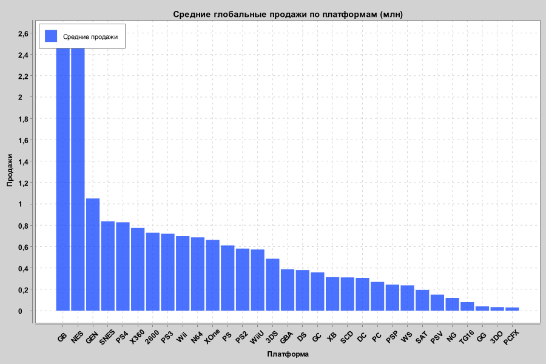
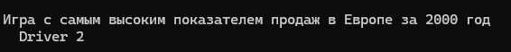
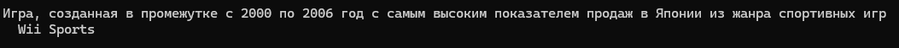

# Video Game Sales

Данный репозиторий содержит датасет с информацией о продажах видеоигр по всему миру. Данные включают рейтинг, название, платформу, год выпуска, жанр, издателя и объёмы продаж в различных регионах.

---
## Технологический стек
- Java 21
- SQLite
- OpenCSV
- XChart

## 1. Запуск приложения
Запустите класс Main через вашу IDE.
Команда для powerShell - mvn clean compile exec:java `-Dexec.mainClass=Main

## 2. Последовательность работы приложения
1. Считывание CSV
2. Сохранение в SQLite
3. Вывод средних продаж по платформам
4. Вывод игры с самым высоким показателем продаж в Европе за 2000 год
5. Вывод игры, созданной в промежутке с 2000 по 2006 год с самым высоким показателем продаж в Японии из жанра спортивных игр
6. Построение графика и сохранение его в файл

### 3. Отчет
1. Построение графика средних глобальных продаж по платформам.

2. Игра с самым высоким показателем продаж в Европе за 2000 год.

3. Игра, созданная в промежутке с 2000 по 2006 год с самым высоким показателем продаж в Японии из жанра спортивных игр.

 

